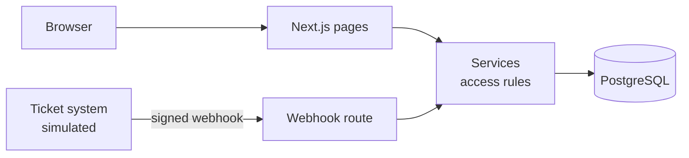

# Helpdesk Demo

[](https://github.com/J41r0Ps/helpdesk-demo/actions/workflows/ci.yml)


A customer helpdesk module for a machine-monitoring platform: customers report and follow up on
support tickets **inside the platform**, while support keeps working in an external ticket system.

> Learning project. I built it to explore how a customer-facing helpdesk can sit on top of an
> external ticket system: a clean API boundary, server-side access rules, and a reliable sync.
> All data is fictional.


<!-- TODO: add a screenshot of the ticket list at docs/screenshots/tickets.png -->

## Features

- **Ticket overview** with filters on status, priority and period, and search in your own tickets
- **Ticket detail** with the full conversation between customer and support
- **New ticket form** that asks the right questions up front: which machine, what kind of problem, since when
- **Role-based access, enforced on the server:** a user sees their own tickets; a manager sees every ticket of their organization
- **Webhook sync** from the ticket system: signed with HMAC-SHA256 and processed exactly once (idempotent)

## Tech stack

| Layer | Technology |
| --- | --- |
| Frontend + backend | Next.js 16 (App Router, server components, server actions, route handlers), TypeScript |
| Styling | Tailwind CSS |
| Data | PostgreSQL 17 (Docker), Prisma 7 |
| Tests | Vitest |
| CI | GitHub Actions: lint, type check, unit tests |

## Architecture



More detail in [docs/architecture.md](docs/architecture.md).

## Getting started

Requirements: Node.js 22+, Docker.

```bash
git clone https://github.com/J41r0Ps/helpdesk-demo.git
cd helpdesk-demo
npm install
cp .env.example .env          # then set WEBHOOK_SECRET
docker compose up -d          # PostgreSQL on port 5432
npx prisma migrate dev        # create the tables
npx prisma db seed            # fictional demo data
npm run dev                   # http://localhost:3000
```

## Demo walkthrough

1. Choose **Anna** (user) in the "log in as" menu: she only sees her own tickets.
2. Switch to **Clara** (manager, same organization): she sees Anna's and Ben's tickets and can filter per person.
3. Open ticket `TS-1001`, then simulate a reply from support:
   ```bash
   npx tsx scripts/simulate-support-reply.ts TS-1001 "A technician will visit tomorrow." IN_PROGRESS
   ```
   Refresh the page: the reply and the new status appear. Run the same event twice and nothing changes.

> The "log in as" menu is a demo shortcut, not real authentication. In production this would be the platform's
> existing login (e.g. OAuth2 / SSO).

## Design decisions

- **Access rules live in one function** ([`ticketScopeFor`](src/lib/access.ts)) that every ticket query uses, and they are unit-tested.
- **A ticket stores its organization**, so a manager still sees it when the reporter leaves the company.
- **Sync strategy:** see [ADR 0001](docs/adr/0001-ticket-synchronisation.md), which compares polling, webhooks and a message queue.

## Tests

```bash
npm test
```

Unit tests cover the access rules (user vs. manager vs. other organization) and webhook signature verification.

## What I would do next

<!-- TODO: fill in honestly after building, e.g. -->
- Integration tests for the webhook route against a test database
- Notifications (e-mail) when support replies
- Link tickets to machine data in both directions

## What I learned

<!-- TODO: 3–4 bullets in your own words, e.g. what surprised you in Next.js coming from React + .NET -->

## License

[MIT](LICENSE) © 2026 Jairo Nacurena Tuy
