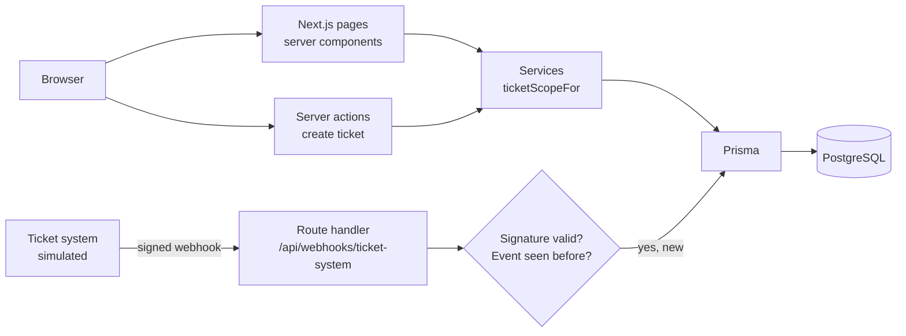

# Architecture

## Layers

| Layer | Folder | Responsibility |
| --- | --- | --- |
| UI | `src/app/**` | Pages (server components) and forms. Never decides who may see what. |
| Services | `src/lib/**` | Business rules: access scope, mapping, webhook verification. Unit-tested. |
| Data | `prisma/`, `src/lib/db.ts` | Schema, migrations, one shared Prisma client. |
| Integration | `src/app/api/webhooks/**` | Receives events from the ticket system, verifies and applies them once. |

## Key rules

- **Access is enforced on the server.** Every ticket query includes `ticketScopeFor(user)`; the UI only hides what the server already refused.
- **The ticket stores its organization.** A manager keeps seeing a ticket even if the reporter leaves the organization.
- **Webhooks are verified and idempotent.** HMAC-SHA256 signature on the raw body; every `eventId` is stored once, so a retried event changes nothing.
- **External ids stay at the edge.** The ticket system's id lives in `Ticket.externalId`; the UI never depends on the ticket system's data model.
